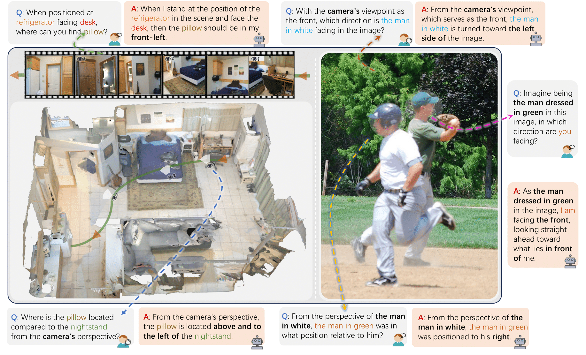
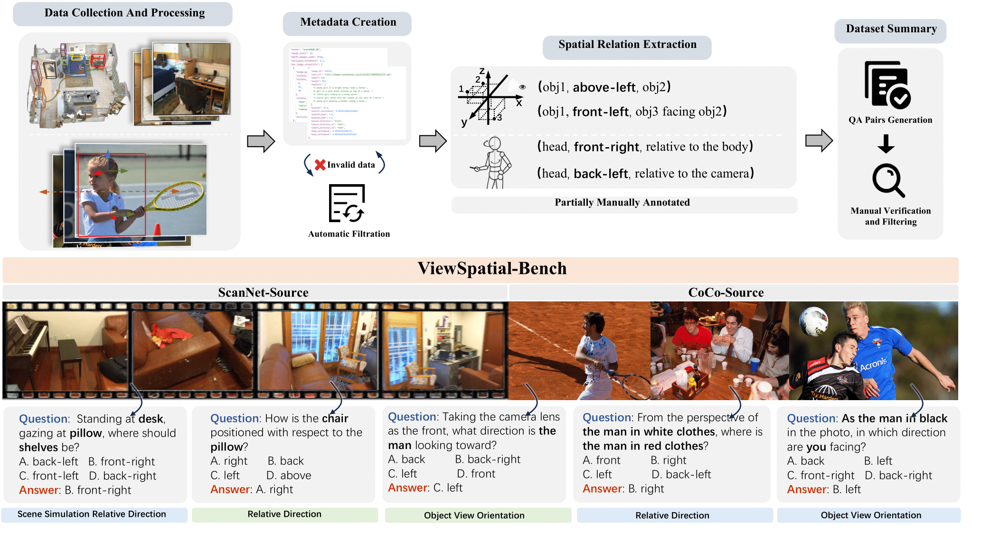
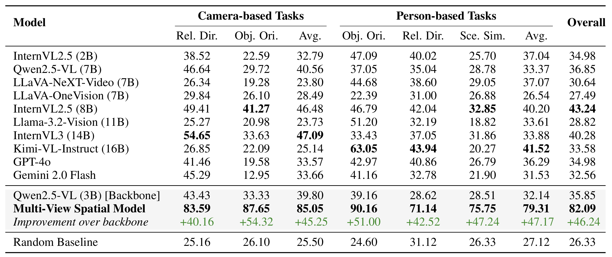

<h1><i>ViewSpatial-Bench</i>:Evaluating Multi-perspective Spatial Localization in Vision-Language Models</h1>

<div align="center">
    <a href="About:blank" target="_blank">
        
    </a>
    <a href="https://huggingface.co/datasets/lidingm/ViewSpatial-Bench" target="_blank">
        
    </a>
    <a href="https://zju-real.github.io/ViewSpatial-Page/" target="_blank">
        
    </a>
</div>

Our work presents a range of spatial localization tasks requiring reasoning from both camera-centric and human-centric perspectives, revealing the challenges visual-language models (VLMs) face in multi-viewpoint spatial understanding. Current VLMs are predominantly trained on image-text pairs from the web that lack explicit 3D spatial annotations, limiting their cross-perspective spatial reasoning capabilities. 

## ViewSpatial-Bench

To address this gap, we introduce **ViewSpatial-Bench**, a comprehensive benchmark with over 5,700 question-answer pairs across 1,000+ 3D scenes from ScanNet and MS-COCO validation sets. This benchmark evaluates VLMs' spatial localization capabilities from multiple perspectives, specifically testing both egocentric (camera) and allocentric (human subject) viewpoints across five distinct task types.The figure below shows the construction pipeline and example demonstrations of our benchmark.



## Multi-View Spatial Model

We present Multi-View Spatial Model (MVSM), developed to address limitations in perspective-dependent spatial reasoning in vision-language models. Following the ViewSpatial-Bench pipeline, we constructed a training dataset of ~43K diverse spatial relationship samples across five task categories, utilizing automated spatial annotations from ScanNet and MS-COCO data, supplemented with Spatial-MM for person-perspective tasks. Using consistent language templates and standardized directional classifications, we implemented a Multi-Perspective Fine-Tuning strategy on Qwen2.5-VL (3B) to enhance reasoning across different observational viewpoints. This approach enables MVSM to develop unified 3D spatial relationship representations that robustly support both camera and human perspective reasoning.

## Results



Accuracy comparison across multiple VLMs on camera and human perspective spatial tasks. Our Multi-View Spatial Model (MVSM) significantly outperforms all baseline models across all task categories, demonstrating the effectiveness of our multi-perspective spatial fine-tuning approach. These results reveal fundamental limitations in perspective-based spatial reasoning capabilities among current VLMs. Even powerful proprietary models like GPT-4o (34.98%) and Gemini-2.0-Flash (32.56%) perform only marginally above random chance (26.33%), confirming our hypothesis that standard VLMs struggle with perspective-dependent spatial reasoning despite their strong performance on other vision-language tasks.


## QuickStart 

```plaintext
ViewSpatial-Bench
├── data_process        # Script code for processing raw datasets to obtain metadata
├── eval                # Used to store the raw dataset of ViewSpatial-Bench
├── ViewSpatial-Bench	# Used to store the source images in ViewSpatial-Bench (can be downloaded from Huggingface)
├── README.md
├── evaluate.py         # Script code for evaluating multiple VLMs on ViewSpatial-Bench
└── requirements.txt    # Dependencies for evaluation
```

**Note**: [CoCo dataset](https://cocodataset.org/) processing in `data_process` uses the original dataset's annotation files (download from official source). Head orientation calculations use [Orient Anything](https://github.com/SpatialVision/Orient-Anything)'s open-source code and model - place `head2body_orientation_data.py` in its root directory to run.

## Evaluation on Your Own Model

**I. With HuggingFace datasets library.**

```py
# NOTE: pip install datasets

from datasets import load_dataset
ds = load_dataset("lidingm/ViewSpatial-Bench")
```

**II. Evaluation using Open-Source Code.**

Evaluate using our open-source evaluation code available on Github.(Coming Soon)

```py
# Clone the repository
git clone https://github.com/ZJU-REAL/ViewSpatial-Bench.git
cd ViewSpatial-Bench

# Install dependencies
pip install -r requirements.txt

# Run evaluation
python evaluate.py --model_path your_model_path
```

You can configure the appropriate model parameters and evaluation settings according to the framework's requirements to obtain performance evaluation results on the ViewSpatial-Bench dataset.

## Acknowledgement

We thank the creators of the [ScanNet](https://github.com/ScanNet/ScanNet) and [MS-COCO](https://cocodataset.org/) datasets for their open-source contributions, which provided the foundational 3D scene data and visual content for our spatial annotation pipeline. We also acknowledge the developers of the [Orient Anything](https://github.com/SpatialVision/Orient-Anything) model for their valuable open-source work that supported our annotation framework development.

## Citation

```
comming soon
```

